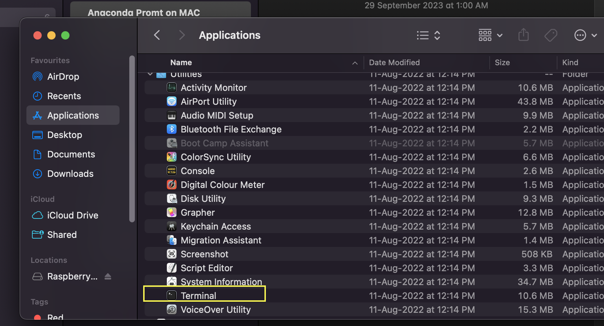
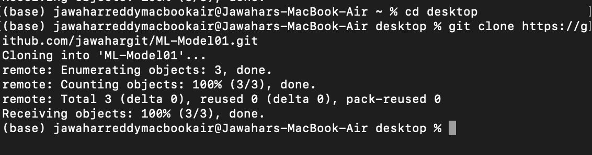
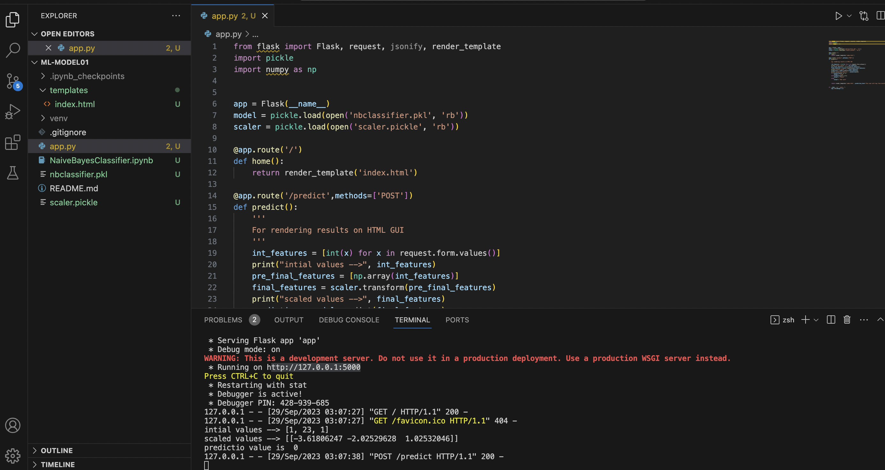

# ML-Model01
Machine Learning Model using Flask

## Below are the steps to run from Anaconda Prompt and Vs code and Jupyternotebook 
Step-1: GO to below Terminal to open Anaconda Prompt

Step-2 :We have already created a GITHUB repository 
Make sure you add a new file .gitignore file and ignore python language
- So that it will ignore all irrelevent files under venv folder during commit
  
Step-3 : in Anaconda Prompt go to CD Desktop
Git clone https://github.com/jawahargit/ML-Model01.git

- Above step will create a folder with same name as GITHUB repo I.e ML-Model01 with git instance

Step-4 : create virtual environment
CD ML-Model01
Conda create -p venv 

Step-5 : Activate virtual Environment 
conda activate /Users/jawaharreddymacbookair/Desktop/ML-Model01/venv

Step-6 : conda install Jupyter

Step-7 : Jupyter notebook

Step-8 : you can open this same folder in vs code by open projects on vscode 
And in terminal -cmd /zsh again activate venv - same as step5

Step-9 : now in Jupyter notebook open in a browser with local host :8888

Step-10: open terminal in notebook and activate venv same as step-5

Step-11 : pip install numpy 
-Pip install pandas
-pip install -U scikit-learn
-Pip install Flask

Step-11 - in VS code add new file app.py 
-Add templates folder under html file 

